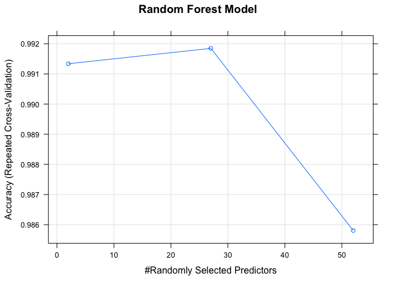
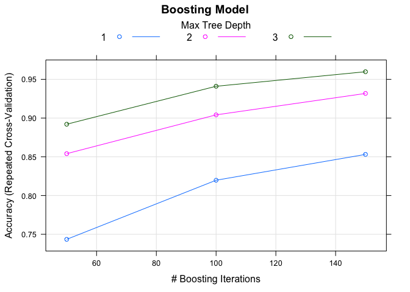
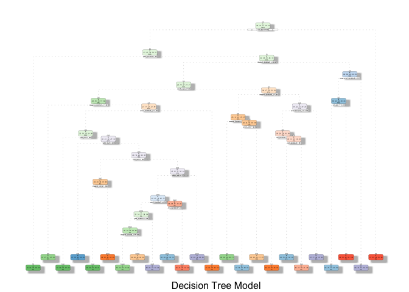

Peer-graded Assignment: Prediction Assignment Writeup


### Introduction
One thing that people regularly do is quantify how much of a particular activity they do, but they rarely quantify how well they do it.  
In this project, use data from accelerometers on the belt, forearm, arm, and dumbell of 6 participants.  
The goal of the project is to predict the manner in which they did the exercise. This is the "classe" variable in the training set.

This paper refers to the WLE dataset:  

Velloso, E.; Bulling, A.; Gellersen, H.; Ugulino, W.; Fuks, H. Qualitative Activity Recognition of Weight Lifting Exercises. Proceedings of 4th International Conference in Cooperation with SIGCHI (Augmented Human '13) . Stuttgart, Germany: ACM SIGCHI, 2013.   

Read more: http://groupware.les.inf.puc-rio.br/har#weight_lifting_exercises#ixzz5AUaLfzAn

##### Load and Examine Data

```
## [1] 19622   160
```

```
## [1]  20 160
```

##### Clean Data     
Remove all columns that contains NA, identification variables, and other variables containing values not related (e.g. timestamps)   


```
## [1] 19622    53
```

```
## [1] 20 53
```

The final training data set is cleaned and contains 19622 observations and 53 variables.   
The final testing data set is cleaned and contains 20 observations and 53 variables.     

##### Cross Validation   

Using the training data set the data is partitioned into 70% training and 30% validation. This will be used for Cross Validation.  


```
## [1] 13737    53
```

```
## [1] 5885   53
```

### Choosing the model    
3 models will be tested; Random Forest, Boosting and Decision Tree.   
For each one, a confusion matrix will be shown to visualise the accuracy and out of sample error.   
The model with the highest accuracy will be used for the 20 test cases.   

##### Random Forest model  


```
## Random Forest 
## 
## 13737 samples
##    52 predictor
##     5 classes: 'A', 'B', 'C', 'D', 'E' 
## 
## No pre-processing
## Resampling: Cross-Validated (5 fold, repeated 1 times) 
## Summary of sample sizes: 10988, 10990, 10991, 10991, 10988 
## Resampling results across tuning parameters:
## 
##   mtry  Accuracy   Kappa    
##    2    0.9913382  0.9890424
##   27    0.9918473  0.9896867
##   52    0.9858049  0.9820406
## 
## Accuracy was used to select the optimal model using the largest value.
## The final value used for the model was mtry = 27.
```

```
## Confusion Matrix and Statistics
## 
##           Reference
## Prediction    A    B    C    D    E
##          A 1674    0    0    0    0
##          B   15 1123    1    0    0
##          C    0    5 1014    7    0
##          D    0    0    9  955    0
##          E    0    0    2    6 1074
## 
## Overall Statistics
##                                           
##                Accuracy : 0.9924          
##                  95% CI : (0.9898, 0.9944)
##     No Information Rate : 0.287           
##     P-Value [Acc > NIR] : < 2.2e-16       
##                                           
##                   Kappa : 0.9903          
##  Mcnemar's Test P-Value : NA              
## 
## Statistics by Class:
## 
##                      Class: A Class: B Class: C Class: D Class: E
## Sensitivity            0.9911   0.9956   0.9883   0.9866   1.0000
## Specificity            1.0000   0.9966   0.9975   0.9982   0.9983
## Pos Pred Value         1.0000   0.9860   0.9883   0.9907   0.9926
## Neg Pred Value         0.9964   0.9989   0.9975   0.9974   1.0000
## Prevalence             0.2870   0.1917   0.1743   0.1645   0.1825
## Detection Rate         0.2845   0.1908   0.1723   0.1623   0.1825
## Detection Prevalence   0.2845   0.1935   0.1743   0.1638   0.1839
## Balanced Accuracy      0.9956   0.9961   0.9929   0.9924   0.9992
```

```
##  Accuracy     Kappa 
## 0.9923534 0.9903254
```

```
## [1] 0.007646559
```

##### Boosting model


```
## Stochastic Gradient Boosting 
## 
## 13737 samples
##    52 predictor
##     5 classes: 'A', 'B', 'C', 'D', 'E' 
## 
## No pre-processing
## Resampling: Cross-Validated (5 fold, repeated 1 times) 
## Summary of sample sizes: 10988, 10990, 10991, 10991, 10988 
## Resampling results across tuning parameters:
## 
##   interaction.depth  n.trees  Accuracy   Kappa    
##   1                   50      0.7434680  0.6747412
##   1                  100      0.8197582  0.7718937
##   1                  150      0.8530990  0.8140913
##   2                   50      0.8540444  0.8151227
##   2                  100      0.9041271  0.8786753
##   2                  150      0.9317895  0.9136642
##   3                   50      0.8920429  0.8633096
##   3                  100      0.9410347  0.9253691
##   3                  150      0.9598163  0.9491570
## 
## Tuning parameter 'shrinkage' was held constant at a value of 0.1
## 
## Tuning parameter 'n.minobsinnode' was held constant at a value of 10
## Accuracy was used to select the optimal model using the largest value.
## The final values used for the model were n.trees = 150,
##  interaction.depth = 3, shrinkage = 0.1 and n.minobsinnode = 10.
```

```
## Confusion Matrix and Statistics
## 
##           Reference
## Prediction    A    B    C    D    E
##          A 1646   13   12    1    2
##          B   39 1074   23    3    0
##          C    0   40  974   11    1
##          D    0    1   34  921    8
##          E    2    9   10   15 1046
## 
## Overall Statistics
##                                           
##                Accuracy : 0.9619          
##                  95% CI : (0.9567, 0.9667)
##     No Information Rate : 0.2867          
##     P-Value [Acc > NIR] : < 2.2e-16       
##                                           
##                   Kappa : 0.9518          
##  Mcnemar's Test P-Value : 1.625e-09       
## 
## Statistics by Class:
## 
##                      Class: A Class: B Class: C Class: D Class: E
## Sensitivity            0.9757   0.9446   0.9250   0.9685   0.9896
## Specificity            0.9933   0.9863   0.9892   0.9913   0.9925
## Pos Pred Value         0.9833   0.9429   0.9493   0.9554   0.9667
## Neg Pred Value         0.9903   0.9867   0.9837   0.9939   0.9977
## Prevalence             0.2867   0.1932   0.1789   0.1616   0.1796
## Detection Rate         0.2797   0.1825   0.1655   0.1565   0.1777
## Detection Prevalence   0.2845   0.1935   0.1743   0.1638   0.1839
## Balanced Accuracy      0.9845   0.9655   0.9571   0.9799   0.9911
```

```
##  Accuracy     Kappa 
## 0.9619371 0.9518422
```

```
## [1] 0.03806287
```

##### Decision Tree model


```
## n= 13737 
## 
## node), split, n, loss, yval, (yprob)
##       * denotes terminal node
## 
##     1) root 13737 9831 A (0.28 0.19 0.17 0.16 0.18)  
##       2) roll_belt< 130.5 12613 8719 A (0.31 0.21 0.19 0.18 0.11)  
##         4) pitch_forearm< -26.45 1218   50 A (0.96 0.041 0 0 0) *
##         5) pitch_forearm>=-26.45 11395 8669 A (0.24 0.23 0.21 0.2 0.12)  
##          10) magnet_dumbbell_y< 434.5 9580 6920 A (0.28 0.18 0.24 0.19 0.11)  
##            20) roll_forearm< 122.5 5916 3537 A (0.4 0.18 0.19 0.17 0.062)  
##              40) magnet_dumbbell_z< -27.5 1966  642 A (0.67 0.21 0.012 0.072 0.033) *
##              41) magnet_dumbbell_z>=-27.5 3950 2869 C (0.27 0.17 0.27 0.21 0.076)  
##                82) accel_dumbbell_y>=-40.5 3461 2410 A (0.3 0.19 0.19 0.24 0.082)  
##                 164) yaw_belt>=168.5 526   83 A (0.84 0.082 0 0.072 0.0038) *
##                 165) yaw_belt< 168.5 2935 2140 D (0.21 0.21 0.22 0.27 0.096)  
##                   330) pitch_belt< -43.15 317   46 B (0.0095 0.85 0.091 0.019 0.025) *
##                   331) pitch_belt>=-43.15 2618 1829 D (0.23 0.13 0.24 0.3 0.1)  
##                     662) roll_belt>=125.5 620  263 C (0.38 0.031 0.58 0.013 0.0032)  
##                      1324) magnet_belt_z< -323.5 203    5 A (0.98 0 0.015 0 0.0099) *
##                      1325) magnet_belt_z>=-323.5 417   63 C (0.086 0.046 0.85 0.019 0) *
##                     663) roll_belt< 125.5 1998 1217 D (0.19 0.16 0.13 0.39 0.14)  
##                      1326) pitch_belt>=1.04 1266  976 B (0.22 0.23 0.14 0.22 0.19)  
##                        2652) accel_dumbbell_z< 27.5 799  538 A (0.33 0.14 0.21 0.28 0.038)  
##                          5304) yaw_forearm>=-94.3 562  301 A (0.46 0.19 0.23 0.078 0.041)  
##                           10608) magnet_forearm_z>=-158 362  107 A (0.7 0.13 0.025 0.099 0.041) *
##                           10609) magnet_forearm_z< -158 200   81 C (0.03 0.29 0.59 0.04 0.04) *
##                          5305) yaw_forearm< -94.3 237   57 D (0 0.03 0.18 0.76 0.03) *
##                        2653) accel_dumbbell_z>=27.5 467  259 E (0.045 0.38 0.0086 0.12 0.45)  
##                          5306) roll_dumbbell< 38.61985 176   36 B (0.051 0.8 0.023 0.034 0.097) *
##                          5307) roll_dumbbell>=38.61985 291  100 E (0.041 0.13 0 0.18 0.66) *
##                      1327) pitch_belt< 1.04 732  232 D (0.12 0.03 0.12 0.68 0.045) *
##                83) accel_dumbbell_y< -40.5 489   57 C (0.0082 0.043 0.88 0.029 0.037) *
##            21) roll_forearm>=122.5 3664 2459 C (0.077 0.17 0.33 0.23 0.19)  
##              42) magnet_dumbbell_y< 289.5 2121 1101 C (0.091 0.14 0.48 0.15 0.15)  
##                84) magnet_forearm_z< -251.5 163   33 A (0.8 0.037 0 0.055 0.11) *
##                85) magnet_forearm_z>=-251.5 1958  938 C (0.032 0.14 0.52 0.15 0.15)  
##                 170) pitch_belt>=26.15 138   29 B (0.1 0.79 0.022 0 0.087) *
##                 171) pitch_belt< 26.15 1820  803 C (0.027 0.095 0.56 0.17 0.15) *
##              43) magnet_dumbbell_y>=289.5 1543 1001 D (0.057 0.22 0.12 0.35 0.25)  
##                86) accel_forearm_x>=-101.5 994  653 E (0.05 0.28 0.16 0.16 0.34)  
##                 172) roll_forearm< 132.5 123   15 C (0.024 0.065 0.88 0 0.033) *
##                 173) roll_forearm>=132.5 871  534 E (0.054 0.31 0.063 0.18 0.39)  
##                   346) roll_dumbbell< 41.39085 215   52 B (0.06 0.76 0.0047 0.084 0.093) *
##                   347) roll_dumbbell>=41.39085 656  339 E (0.052 0.17 0.082 0.21 0.48) *
##                87) accel_forearm_x< -101.5 549  165 D (0.069 0.11 0.04 0.7 0.082) *
##          11) magnet_dumbbell_y>=434.5 1815  913 B (0.036 0.5 0.047 0.23 0.19)  
##            22) total_accel_dumbbell>=5.5 1309  481 B (0.05 0.63 0.063 0.026 0.23)  
##              44) roll_belt>=-0.58 1107  279 B (0.06 0.75 0.075 0.031 0.087) *
##              45) roll_belt< -0.58 202    0 E (0 0 0 0 1) *
##            23) total_accel_dumbbell< 5.5 506  130 D (0 0.15 0.0059 0.74 0.1) *
##       3) roll_belt>=130.5 1124   12 E (0.011 0 0 0 0.99) *
```

```
## Confusion Matrix and Statistics
## 
##           Reference
## Prediction    A    B    C    D    E
##          A 1506  259   20   96   36
##          B   46  624   41   23   69
##          C   43  110  879  160  119
##          D   61   92   59  613   47
##          E   18   54   27   72  811
## 
## Overall Statistics
##                                          
##                Accuracy : 0.7533         
##                  95% CI : (0.742, 0.7642)
##     No Information Rate : 0.2845         
##     P-Value [Acc > NIR] : < 2.2e-16      
##                                          
##                   Kappa : 0.6866         
##  Mcnemar's Test P-Value : < 2.2e-16      
## 
## Statistics by Class:
## 
##                      Class: A Class: B Class: C Class: D Class: E
## Sensitivity            0.8996   0.5478   0.8567   0.6359   0.7495
## Specificity            0.9024   0.9623   0.9111   0.9474   0.9644
## Pos Pred Value         0.7856   0.7771   0.6705   0.7030   0.8259
## Neg Pred Value         0.9577   0.8987   0.9679   0.9300   0.9447
## Prevalence             0.2845   0.1935   0.1743   0.1638   0.1839
## Detection Rate         0.2559   0.1060   0.1494   0.1042   0.1378
## Detection Prevalence   0.3257   0.1364   0.2228   0.1482   0.1669
## Balanced Accuracy      0.9010   0.7551   0.8839   0.7916   0.8570
```

```
##  Accuracy     Kappa 
## 0.7532710 0.6865516
```

```
## [1] 0.246729
```

### Result    

The Random Forest model had the highest accuracy and so will be used on the 20 test cases.   

### Prediction of 20 test cases   


```
##  [1] B A B A A E D B A A B C B A E E A B B B
## Levels: A B C D E
```

### Appendix of Figures

<!-- -->

<!-- -->


```
## Warning: labs do not fit even at cex 0.15, there may be some overplotting
```

<!-- -->


